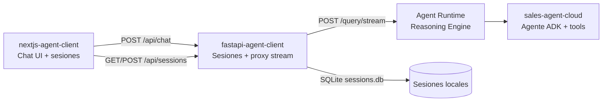

> **Versión en inglés:** [README.md](README.md)

# Gemini Enterprise Agent Platform Workshop

<p align="center">
  <strong>Construye, despliega y chatea con un asistente de ventas multi-agente en Google Cloud.</strong>
</p>

<p align="center">
  <a href="https://adk.dev/"></a>
  <a href="https://cloud.google.com/vertex-ai/generative-ai/docs/agent-engine/overview"></a>
  <a href="https://cloud.google.com/products/gemini-enterprise"></a>
  <a href="https://nextjs.org/"></a>
  <a href="https://fastapi.tiangolo.com/"></a>
</p>

Repositorio hands-on del ciclo de vida completo de un agente: desde un agente ADK local con herramientas y sub-agentes, hasta el despliegue en Agent Runtime y una UI de chat que transmite tool calls en tiempo real.

Conoce a **Tecno**, el asistente de ventas de TechZone: busca productos, gestiona un carrito de sesión, cierra pedidos y delega objeciones de precio a un especialista en descuentos — todo anclado en herramientas, sin inventar inventario.

---

## Empezar aquí — Tutorial local

> **¿Primera vez con el workshop?** Comienza por el tutorial paso a paso antes de desplegar.

| | |
| - | - |
| **[TUTORIAL.es.md](TUTORIAL.es.md)** | Guía en español: requisitos → API key → implementar agente → `agents-cli playground` |
| **[TUTORIAL.md](TUTORIAL.md)** | Misma guía en inglés |
| **[agent.txt](agent.txt)** | Código de referencia para copiar en `sales-agent-cloud/app/agent.py` |
| **Duración** | 45–90 minutos |

```bash
# Resumen del tutorial
uvx google-agents-cli setup
cd sales-agent-cloud && agents-cli install
# implementar app/agent.py (ver agent.txt)
agents-cli playground
```

Cuando **Tecno** funcione en el playground, vuelve aquí para evaluar, desplegar y conectar la UI.

---

## Qué incluye el workshop

<table>
<tr><td><b>Multi-agente nativo</b></td><td>Agente de ventas raíz + sub-agente de descuentos. Handoffs con <code>sub_agents</code> de ADK.</td></tr>
<tr><td><b>Comercio anclado en tools</b></td><td>Buscar productos, carrito, totales y pedidos. Precios y stock siempre desde Python.</td></tr>
<tr><td><b>Streaming en vivo</b></td><td>NDJSON desde Agent Runtime → proxy FastAPI → UI Next.js.</td></tr>
<tr><td><b>Sesiones persistentes</b></td><td>Sidebar multi-chat con SQLite local. Crear, cambiar y borrar conversaciones.</td></tr>
<tr><td><b>Listo para desplegar</b></td><td>Terraform, Cloud Build, telemetría y eval vía <code>agents-cli</code>.</td></tr>
<tr><td><b>Publicar en Gemini Enterprise</b></td><td>Registrar el reasoning engine para que equipos lo descubran y usen.</td></tr>
</table>

---

## Arquitectura de despliegue



| Capa | Carpeta | Rol |
| ---- | ------- | --- |
| **Agente** | [`sales-agent-cloud/`](sales-agent-cloud/) | ADK, tools, sub-agentes, eval, Terraform, CI/CD |
| **Backend** | [`fastapi-agent-client/`](fastapi-agent-client/) | Cliente Reasoning Engine, CRUD sesiones, streaming NDJSON |
| **Frontend** | [`nextjs-agent-client/`](nextjs-agent-client/) | Chat Next.js — markdown, adjuntos, tool calls, sidebar |

### Estructura del proyecto

```
gemini-enterprise-agent-platform-workshop/
├── README.md                   # Versión en inglés
├── README.es.md                # Este archivo (español)
├── TUTORIAL.md                 # Tutorial local en inglés
├── TUTORIAL.es.md              # Tutorial local en español
├── agent.txt                   # Código de referencia del agente
├── sales-agent-cloud/          # Agente ADK (TechZone)
│   ├── app/agent.py
│   ├── app/agent_runtime_app.py
│   ├── deployment/             # Terraform (single-project + CI/CD)
│   └── tests/
├── fastapi-agent-client/       # API streaming + sesiones
└── nextjs-agent-client/        # UI de chat
```

---

## Requisitos previos (despliegue)

| Herramienta | Uso | Instalar |
| ----------- | --- | -------- |
| **uv** | Dependencias Python | [astral.sh/uv](https://docs.astral.sh/uv/getting-started/installation/) |
| **pnpm** | Frontend Next.js | [pnpm.io](https://pnpm.io/installation) |
| **agents-cli** | Playground, deploy, publish | `uv tool install google-agents-cli` |
| **Google Cloud SDK** | Auth y despliegue | [cloud.google.com/sdk](https://cloud.google.com/sdk/docs/install) |
| **Terraform** | Infraestructura (opcional) | [terraform.io](https://developer.hashicorp.com/terraform/downloads) |

```bash
gcloud auth application-default login
gcloud config set project YOUR_PROJECT_ID
```

---

## Inicio rápido — Despliegue

Asume que ya completaste el [tutorial local](TUTORIAL.es.md) y el agente funciona en playground.

### 1 — Desplegar en Agent Runtime

```bash
cd sales-agent-cloud
agents-cli deploy
```

Anota el **Reasoning Engine resource name** — lo necesitarás en FastAPI.

Publicar en Gemini Enterprise:

```bash
agents-cli publish gemini-enterprise
```

### 2 — Backend FastAPI

Actualiza `REASONING_ENGINE_ID` y `PROJECT_ID` en `fastapi-agent-client/main.py`.

```bash
cd fastapi-agent-client
uv sync
uv run fastapi dev                     # http://localhost:8000
```

| Método | Ruta | Descripción |
| ------ | ---- | ----------- |
| `GET` | `/health` | Estado de salud y conexión al agente |
| `GET` | `/sessions` | Listar sesiones de chat |
| `POST` | `/sessions` | Crear sesión |
| `PUT` | `/sessions/{id}` | Actualizar título o mensajes |
| `DELETE` | `/sessions/{id}` | Eliminar sesión |
| `POST` | `/query/stream` | Respuesta del agente en streaming (NDJSON) |

### 3 — Frontend Next.js

```bash
cd nextjs-agent-client
pnpm install
pnpm dev                               # http://localhost:3000
```

`BACKEND_URL=http://localhost:8000` si FastAPI no corre en el puerto por defecto.

---

## El agente TechZone

Flujo de venta simulado en español:

1. **Descubrir** — `buscar_productos` por nombre o categoría
2. **Carrito** — `agregar_al_carrito` / `ver_carrito` con estado de sesión ADK
3. **Objeciones** — handoff a `agente_descuentos` (máx. 10% en un producto)
4. **Cierre** — `confirmar_pedido` descuenta stock y crea la orden

---

## Referencia de comandos

### Agente (`sales-agent-cloud/`)

| Comando | Descripción |
| ------- | ----------- |
| `agents-cli playground` | Servidor local ADK con hot reload |
| `agents-cli eval generate` | Ejecutar dataset de eval |
| `agents-cli eval grade` | Calificar trazas con LLM-as-judge |
| `agents-cli deploy` | Desplegar en Agent Runtime |
| `agents-cli publish gemini-enterprise` | Registrar en Gemini Enterprise |
| `uv run pytest tests/unit tests/integration` | Tests unitarios e integración |

### Backend y frontend

| Carpeta | Comando | Descripción |
| ------- | ------- | ----------- |
| `fastapi-agent-client/` | `uv run fastapi dev` | Servidor en puerto 8000 |
| `nextjs-agent-client/` | `pnpm dev` | UI en puerto 3000 |

---

## Flujo de desarrollo

```bash
# Terminal 1 — agente (o playground si aún iteras)
cd sales-agent-cloud && agents-cli playground

# Terminal 2 — backend contra Reasoning Engine desplegado
cd fastapi-agent-client && uv run fastapi dev

# Terminal 3 — UI de chat
cd nextjs-agent-client && pnpm dev
```

1. **Build** — [tutorial](TUTORIAL.es.md) + playground
2. **Evaluate** — `agents-cli eval generate` → `agents-cli eval grade`
3. **Test** — `uv run pytest tests/unit tests/integration`
4. **Deploy** — `agents-cli deploy` → actualizar engine ID en FastAPI
5. **Publish** — `agents-cli publish gemini-enterprise`

---

## Observabilidad y documentación

Telemetría integrada a **Cloud Trace**, **BigQuery** y **Cloud Logging** (`sales-agent-cloud/deployment/terraform/`).

| Recurso | Contenido |
| ------- | --------- |
| [TUTORIAL.es.md](TUTORIAL.es.md) | Tutorial local paso a paso (español) |
| [TUTORIAL.md](TUTORIAL.md) | Tutorial local paso a paso (inglés) |
| [ADK docs](https://adk.dev/) | Agentes, tools, sesiones, sub-agentes |
| [agents-cli](https://google.github.io/adk-docs/tools/agents-cli/) | Scaffold, deploy, eval, infra |
| [Agent Runtime](https://cloud.google.com/vertex-ai/generative-ai/docs/agent-engine/overview) | Hosting del reasoning engine |
| [`sales-agent-cloud/GEMINI.md`](sales-agent-cloud/GEMINI.md) | Fases de desarrollo asistido por IA |

---

## Sobre el autor

<table>
<tr>
<td width="140" valign="top">

</td>
<td valign="top">

**Leonardo Burbano** · Senior AI Engineer & Tech Lead · @Mercately [Techstars]

<a href="https://github.com/leonardoburbanov"></a>
<a href="https://www.linkedin.com/in/leoburbano/"></a>
<a href="https://www.instagram.com/leo.burbano.ai/"></a>

Lidero el equipo de IA en Mercately, donde diseño e implemento agentes conversacionales, pipelines RAG y flujos multi-agente sobre Google Cloud y Gemini.

</td>
</tr>
</table>

---

## Licencia

Materiales del workshop — ver licencias de cada componente. El scaffold del agente ADK sigue el header Apache 2.0 de Google en `sales-agent-cloud/app/`.

Construido para el **Gemini Enterprise Agent Platform Workshop**.
