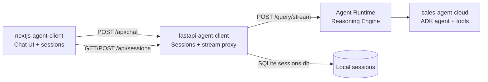

> **Also available in Spanish:** [README.es.md](README.es.md)

# Gemini Enterprise Agent Platform Workshop

<p align="center">
  <strong>Build, deploy, and chat with a multi-agent sales assistant on Google Cloud.</strong>
</p>

<p align="center">
  <a href="https://adk.dev/"></a>
  <a href="https://cloud.google.com/vertex-ai/generative-ai/docs/agent-engine/overview"></a>
  <a href="https://cloud.google.com/products/gemini-enterprise"></a>
  <a href="https://nextjs.org/"></a>
  <a href="https://fastapi.tiangolo.com/"></a>
</p>

Hands-on workshop repo for the full agent lifecycle — from a local ADK agent with tools and sub-agents, through Agent Runtime deployment on Vertex AI, to a production-style chat UI that streams tool calls in real time.

Meet **Tecno**, the TechZone sales assistant: it searches a product catalog, manages a session cart, closes orders, and delegates price objections to a dedicated discount specialist — all grounded in tool output, never hallucinated inventory.

---

## Start here — Local tutorial

> **First time with the workshop?** Start with the step-by-step tutorial before deploying.

| | |
| - | - |
| **[TUTORIAL.md](TUTORIAL.md)** | English guide: prerequisites → API key → implement agent → `agents-cli playground` |
| **[TUTORIAL.es.md](TUTORIAL.es.md)** | Same guide in Spanish |
| **[agent.txt](agent.txt)** | Reference code to copy into `sales-agent-cloud/app/agent.py` |
| **Duration** | 45–90 minutes |

```bash
# Tutorial summary
uvx google-agents-cli setup
cd sales-agent-cloud && agents-cli install
# implement app/agent.py (see agent.txt)
agents-cli playground
```

Once **Tecno** works in the playground, return here to evaluate, deploy, and connect the UI.

---

## What this workshop includes

<table>
<tr><td><b>Multi-agent by design</b></td><td>Root sales agent + discount sub-agent. Handoffs via native ADK <code>sub_agents</code>.</td></tr>
<tr><td><b>Tool-grounded commerce</b></td><td>Search products, cart, totals, and orders. Stock and prices always from Python tools.</td></tr>
<tr><td><b>Stream everything</b></td><td>NDJSON from Agent Runtime → FastAPI proxy → Next.js UI.</td></tr>
<tr><td><b>Session sidebar</b></td><td>Multi-chat UI with local SQLite. Create, switch, and delete conversations.</td></tr>
<tr><td><b>Deploy-ready agent</b></td><td>Terraform, Cloud Build, telemetry, and eval via <code>agents-cli</code>.</td></tr>
<tr><td><b>Publish to Gemini Enterprise</b></td><td>Register your reasoning engine so teams can discover and use the agent.</td></tr>
</table>

---

## Deployment architecture



| Layer | Folder | Role |
| ----- | ------ | ---- |
| **Agent** | [`sales-agent-cloud/`](sales-agent-cloud/) | ADK agent, tools, sub-agents, eval, Terraform, CI/CD |
| **Backend** | [`fastapi-agent-client/`](fastapi-agent-client/) | Reasoning Engine client, session CRUD, streaming NDJSON |
| **Frontend** | [`nextjs-agent-client/`](nextjs-agent-client/) | Next.js chat — markdown, attachments, tool calls, session sidebar |

### Project structure

```
gemini-enterprise-agent-platform-workshop/
├── README.md                   # This file (English)
├── README.es.md                # Spanish version
├── TUTORIAL.md                 # Local tutorial (English)
├── TUTORIAL.es.md              # Local tutorial (Spanish)
├── agent.txt                   # Agent reference code
├── sales-agent-cloud/          # ADK agent (TechZone)
│   ├── app/agent.py
│   ├── app/agent_runtime_app.py
│   ├── deployment/             # Terraform (single-project + CI/CD)
│   └── tests/
├── fastapi-agent-client/       # Streaming API + sessions
└── nextjs-agent-client/        # Chat UI
```

---

## Prerequisites (deployment)

| Tool | Used for | Install |
| ---- | -------- | ------- |
| **uv** | Python dependencies | [astral.sh/uv](https://docs.astral.sh/uv/getting-started/installation/) |
| **pnpm** | Next.js frontend | [pnpm.io](https://pnpm.io/installation) |
| **agents-cli** | Playground, deploy, publish | `uv tool install google-agents-cli` |
| **Google Cloud SDK** | Auth and deployment | [cloud.google.com/sdk](https://cloud.google.com/sdk/docs/install) |
| **Terraform** | Infrastructure (optional) | [terraform.io](https://developer.hashicorp.com/terraform/downloads) |

```bash
gcloud auth application-default login
gcloud config set project YOUR_PROJECT_ID
```

---

## Quick start — Deployment

Assumes you completed the [local tutorial](TUTORIAL.md) and the agent works in the playground.

### 1 — Deploy to Agent Runtime

```bash
cd sales-agent-cloud
agents-cli deploy
```

Note your **Reasoning Engine resource name** — you will wire it into FastAPI.

Publish to Gemini Enterprise:

```bash
agents-cli publish gemini-enterprise
```

### 2 — FastAPI backend

Update `REASONING_ENGINE_ID` and `PROJECT_ID` in `fastapi-agent-client/main.py`.

```bash
cd fastapi-agent-client
uv sync
uv run fastapi dev                     # http://localhost:8000
```

| Method | Path | Description |
| ------ | ---- | ----------- |
| `GET` | `/health` | Health and agent connection status |
| `GET` | `/sessions` | List chat sessions |
| `POST` | `/sessions` | Create a session |
| `PUT` | `/sessions/{id}` | Update title or messages |
| `DELETE` | `/sessions/{id}` | Delete a session |
| `POST` | `/query/stream` | Stream agent response (NDJSON) |

### 3 — Next.js frontend

```bash
cd nextjs-agent-client
pnpm install
pnpm dev                               # http://localhost:3000
```

Set `BACKEND_URL=http://localhost:8000` if FastAPI runs on a non-default port.

---

## The TechZone agent

Simulated tech store sales flow in Spanish:

1. **Discover** — `buscar_productos` searches by name or category
2. **Cart** — `agregar_al_carrito` / `ver_carrito` manage session state via ADK `ToolContext`
3. **Objections** — hand off to `agente_descuentos` (max 10% on one item)
4. **Close** — `confirmar_pedido` deducts stock and creates an order

---

## Commands reference

### Agent (`sales-agent-cloud/`)

| Command | Description |
| ------- | ----------- |
| `agents-cli playground` | Local ADK dev server with hot reload |
| `agents-cli eval generate` | Run agent against eval dataset |
| `agents-cli eval grade` | Grade traces with LLM-as-judge |
| `agents-cli deploy` | Deploy to Agent Runtime |
| `agents-cli publish gemini-enterprise` | Register in Gemini Enterprise |
| `uv run pytest tests/unit tests/integration` | Unit and integration tests |

### Backend and frontend

| Folder | Command | Description |
| ------ | ------- | ----------- |
| `fastapi-agent-client/` | `uv run fastapi dev` | Dev server on port 8000 |
| `nextjs-agent-client/` | `pnpm dev` | UI on port 3000 |

---

## Development workflow

```bash
# Terminal 1 — agent (or playground while iterating)
cd sales-agent-cloud && agents-cli playground

# Terminal 2 — backend against deployed Reasoning Engine
cd fastapi-agent-client && uv run fastapi dev

# Terminal 3 — chat UI
cd nextjs-agent-client && pnpm dev
```

1. **Build** — [tutorial](TUTORIAL.md) + playground
2. **Evaluate** — `agents-cli eval generate` → `agents-cli eval grade`
3. **Test** — `uv run pytest tests/unit tests/integration`
4. **Deploy** — `agents-cli deploy` → update FastAPI engine ID
5. **Publish** — `agents-cli publish gemini-enterprise`

---

## Observability and documentation

Built-in telemetry to **Cloud Trace**, **BigQuery**, and **Cloud Logging** (`sales-agent-cloud/deployment/terraform/`).

| Resource | What's covered |
| -------- | -------------- |
| [TUTORIAL.md](TUTORIAL.md) | Step-by-step local tutorial (English) |
| [TUTORIAL.es.md](TUTORIAL.es.md) | Step-by-step local tutorial (Spanish) |
| [ADK docs](https://adk.dev/) | Agents, tools, sessions, sub-agents |
| [agents-cli](https://google.github.io/adk-docs/tools/agents-cli/) | Scaffold, deploy, eval, infra |
| [Agent Runtime](https://cloud.google.com/vertex-ai/generative-ai/docs/agent-engine/overview) | Managed reasoning engine hosting |
| [`sales-agent-cloud/GEMINI.md`](sales-agent-cloud/GEMINI.md) | AI-assisted dev phases |

---

## About the author

<table>
<tr>
<td width="140" valign="top">

</td>
<td valign="top">

**Leonardo Burbano** · Senior AI Engineer & Tech Lead · @Mercately [Techstars]

<a href="https://github.com/leonardoburbanov"></a>
<a href="https://www.linkedin.com/in/leoburbano/"></a>
<a href="https://www.instagram.com/leo.burbano.ai/"></a>

I lead the AI team at Mercately, designing and shipping conversational agents, RAG pipelines, and multi-agent workflows on Google Cloud and Gemini.

</td>
</tr>
</table>

---

## License

Workshop materials — see individual component licenses. The ADK agent scaffold follows the Google Apache 2.0 header in `sales-agent-cloud/app/`.

Built for the **Gemini Enterprise Agent Platform Workshop**.
