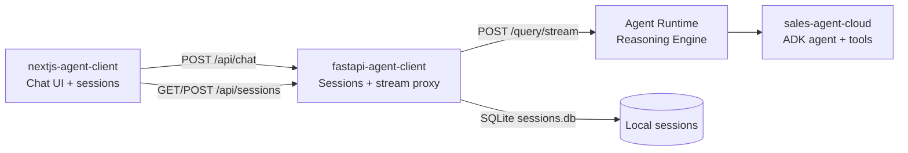

# Gemini Enterprise Agent Platform Workshop

<p align="center">
  <strong>Build, deploy, and chat with a multi-agent sales assistant on Google Cloud.</strong>
</p>

<p align="center">
  <a href="https://adk.dev/"></a>
  <a href="https://cloud.google.com/vertex-ai/generative-ai/docs/agent-engine/overview"></a>
  <a href="https://cloud.google.com/products/gemini-enterprise"></a>
  <a href="https://nextjs.org/"></a>
  <a href="https://fastapi.tiangolo.com/"></a>
</p>

**A hands-on workshop repo for the full agent lifecycle** — from a local ADK agent with tools and sub-agents, through Agent Runtime deployment on Vertex AI, to a production-style chat UI that streams tool calls in real time.

Meet **Tecno**, the TechZone sales assistant: it searches a product catalog, manages a session cart, closes orders, and delegates price objections to a dedicated discount specialist — all grounded in tool output, never hallucinated inventory.

<table>
<tr><td><b>Multi-agent by design</b></td><td>Root sales agent + sub-agent for price objections. Handoffs are native ADK <code>sub_agents</code>, not prompt hacks.</td></tr>
<tr><td><b>Tool-grounded commerce</b></td><td>Search products, add to cart, review totals, confirm orders. Stock and prices always come from Python tools.</td></tr>
<tr><td><b>Stream everything</b></td><td>NDJSON from Agent Runtime → FastAPI proxy → Next.js UI. Text, tool inputs, and tool outputs render live.</td></tr>
<tr><td><b>Session sidebar</b></td><td>Multi-chat UI with persisted sessions (SQLite locally). Create, switch, and delete conversations without losing context.</td></tr>
<tr><td><b>Deploy-ready agent</b></td><td>Terraform, Cloud Build, telemetry, and eval harness included via <code>agents-cli</code>. One command to Agent Runtime.</td></tr>
<tr><td><b>Publish to Gemini Enterprise</b></td><td>Register your deployed reasoning engine so teams can discover and use the agent inside Gemini Enterprise.</td></tr>
</table>

---

## Architecture



| Layer | Folder | Role |
| ----- | ------ | ---- |
| **Agent** | [`sales-agent-cloud/`](sales-agent-cloud/) | ADK agent, tools, sub-agents, eval, Terraform, CI/CD |
| **Backend** | [`fastapi-agent-client/`](fastapi-agent-client/) | Vertex AI Reasoning Engine client, session CRUD, streaming NDJSON |
| **Frontend** | [`nextjs-agent-client/`](nextjs-agent-client/) | Next.js chat app — markdown, attachments, tool-call markers, session sidebar |

---

## Project Structure

```
gemini-enterprise-agent-platform-workshop/
├── sales-agent-cloud/          # ADK agent (TechZone sales)
│   ├── app/agent.py            # Root agent, tools, sub-agents
│   ├── app/agent_runtime_app.py
│   ├── deployment/             # Terraform (single-project + CI/CD)
│   ├── tests/                  # Unit, integration, eval, load tests
│   └── GEMINI.md               # AI-assisted dev guide for agents-cli
├── fastapi-agent-client/       # Streaming API + session store
│   ├── main.py
│   └── Dockerfile
└── nextjs-agent-client/        # Chat UI
    ├── src/app/page.tsx
    ├── src/app/api/chat/       # Gemini NDJSON → AI SDK stream adapter
    └── Dockerfile
```

---

## Prerequisites

| Tool | Used for | Install |
| ---- | -------- | ------- |
| **uv** | Python deps (agent + FastAPI) | [astral.sh/uv](https://docs.astral.sh/uv/getting-started/installation/) |
| **pnpm** | Next.js frontend | [pnpm.io](https://pnpm.io/installation) |
| **agents-cli** | Scaffold, playground, deploy, publish | `uv tool install google-agents-cli` |
| **Google Cloud SDK** | Auth + deployment | [cloud.google.com/sdk](https://cloud.google.com/sdk/docs/install) |
| **Terraform** | Infrastructure (optional) | [terraform.io](https://developer.hashicorp.com/terraform/downloads) |

Authenticate with GCP before running the agent or deploying:

```bash
gcloud auth application-default login
gcloud config set project YOUR_PROJECT_ID
```

---

## Quick Start

### 1 — Agent (local playground)

```bash
cd sales-agent-cloud
uvx google-agents-cli setup          # one-time: CLI + skills
agents-cli install
agents-cli playground                  # ADK web UI, hot-reload on save
```

Edit agent logic in `sales-agent-cloud/app/agent.py`. The playground is the fastest way to iterate on tools, instructions, and sub-agent handoffs.

### 2 — Deploy to Agent Runtime

```bash
cd sales-agent-cloud
agents-cli deploy
```

After deploy, note your **Reasoning Engine resource name** — you will wire it into the FastAPI client.

Publish to Gemini Enterprise when ready:

```bash
agents-cli publish gemini-enterprise
```

### 3 — FastAPI backend

Update `REASONING_ENGINE_ID` and `PROJECT_ID` in `fastapi-agent-client/main.py` (or refactor to env vars) to match your deployment.

```bash
cd fastapi-agent-client
uv sync
uv run fastapi dev                     # http://localhost:8000
```

Endpoints:

| Method | Path | Description |
| ------ | ---- | ----------- |
| `GET` | `/health` | Health + agent connection status |
| `GET` | `/sessions` | List chat sessions for a user |
| `POST` | `/sessions` | Create a session |
| `PUT` | `/sessions/{id}` | Update title or messages |
| `DELETE` | `/sessions/{id}` | Delete a session |
| `POST` | `/query/stream` | Stream agent response (NDJSON) |

> **Note:** `sessions.db` is created at startup and gitignored. On Cloud Run the filesystem is ephemeral — sessions reset on redeploy unless you add persistent storage or an external database.

### 4 — Next.js frontend

```bash
cd nextjs-agent-client
pnpm install
pnpm dev                               # http://localhost:3000
```

Set `BACKEND_URL=http://localhost:8000` if the FastAPI server runs on a non-default host or port.

Open the app, start a chat, and watch tool calls (`buscar_productos`, `agregar_al_carrito`, …) stream inline as the agent works.

---

## The TechZone Agent

The workshop agent simulates a tech store sales flow in Spanish:

1. **Discover** — `buscar_productos` searches by name or category
2. **Cart** — `agregar_al_carrito` / `ver_carrito` manage session state via ADK `ToolContext`
3. **Objections** — hand off to `agente_descuentos` (max 10% on one item)
4. **Close** — `confirmar_pedido` deducts stock and creates an order

The root agent never invents catalog data — every price, image URL, and stock count comes from the tool layer.

---

## Commands Reference

### Agent (`sales-agent-cloud/`)

| Command | Description |
| ------- | ----------- |
| `agents-cli playground` | Local ADK dev server with hot reload |
| `agents-cli lint` | Ruff, ty, codespell |
| `agents-cli eval generate` | Run agent against eval dataset |
| `agents-cli eval grade` | Grade traces with LLM-as-judge |
| `agents-cli deploy` | Deploy to Agent Runtime |
| `agents-cli publish gemini-enterprise` | Register in Gemini Enterprise |
| `agents-cli infra single-project` | Terraform: single GCP project |
| `agents-cli infra cicd` | Full CI/CD pipeline + infra |
| `uv run pytest tests/unit tests/integration` | Unit + integration tests |

See [`sales-agent-cloud/README.md`](sales-agent-cloud/README.md) for eval, observability, and deployment details.

### Backend (`fastapi-agent-client/`)

| Command | Description |
| ------- | ----------- |
| `uv sync` | Install dependencies |
| `uv run fastapi dev` | Dev server on port 8000 |
| `uv run fastapi run main.py --port 8080` | Production-style run (Docker default) |

### Frontend (`nextjs-agent-client/`)

| Command | Description |
| ------- | ----------- |
| `pnpm dev` | Dev server on port 3000 |
| `pnpm build` | Production build (standalone output) |
| `pnpm start` | Serve production build |

---

## Docker

Both clients ship Dockerfiles for Cloud Run or any container host.

```bash
# FastAPI
cd fastapi-agent-client
docker build -t agent-backend .
docker run -p 8080:8080 agent-backend

# Next.js
cd nextjs-agent-client
docker build -t agent-frontend .
docker run -p 8080:8080 -e BACKEND_URL=https://your-backend-url agent-frontend
```

For production, update CORS in `fastapi-agent-client/main.py` — it currently allows `http://localhost:3000` only.

---

## Development Workflow

```bash
# Terminal 1 — iterate on agent logic
cd sales-agent-cloud && agents-cli playground

# Terminal 2 — backend against deployed Reasoning Engine
cd fastapi-agent-client && uv run fastapi dev

# Terminal 3 — chat UI
cd nextjs-agent-client && pnpm dev
```

Recommended iteration loop (from `GEMINI.md`):

1. **Build** — edit `app/agent.py`, test in playground
2. **Evaluate** — `agents-cli eval generate` → `agents-cli eval grade`
3. **Test** — `uv run pytest tests/unit tests/integration`
4. **Deploy** — `agents-cli deploy` → update FastAPI engine ID → smoke-test via Next.js UI
5. **Publish** — `agents-cli publish gemini-enterprise`

---

## Observability

The agent project includes built-in telemetry to **Cloud Trace**, **BigQuery**, and **Cloud Logging**. Terraform modules under `sales-agent-cloud/deployment/terraform/` configure the plumbing.

---

## Documentation

| Resource | What's covered |
| -------- | -------------- |
| [ADK docs](https://adk.dev/) | Agents, tools, sessions, sub-agents |
| [agents-cli](https://google.github.io/adk-docs/tools/agents-cli/) | Scaffold, deploy, eval, infra |
| [Agent Runtime](https://cloud.google.com/vertex-ai/generative-ai/docs/agent-engine/overview) | Managed reasoning engine hosting |
| [Gemini Enterprise](https://cloud.google.com/products/gemini-enterprise) | Enterprise agent discovery & governance |
| [`sales-agent-cloud/GEMINI.md`](sales-agent-cloud/GEMINI.md) | AI-assisted dev phases for this repo |

---

## License

Workshop materials — see individual component licenses. The ADK agent scaffold follows the Google Apache 2.0 header in `sales-agent-cloud/app/`.

Built for the **Gemini Enterprise Agent Platform Workshop**.
