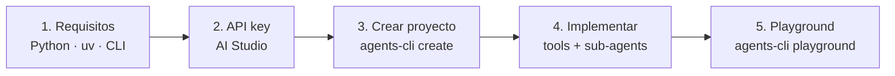
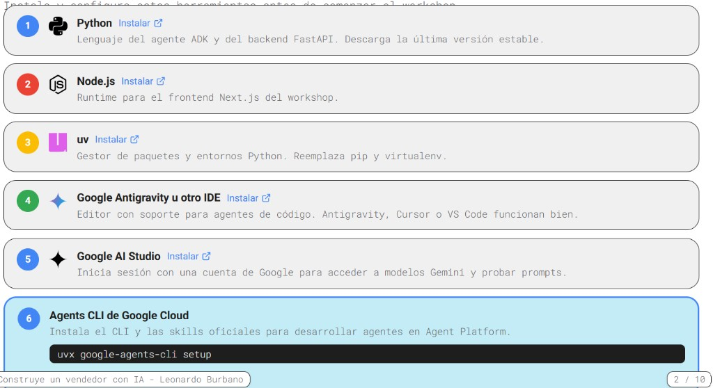
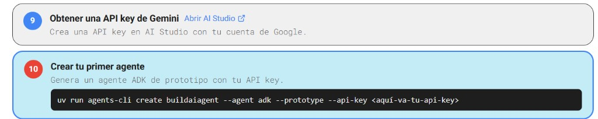
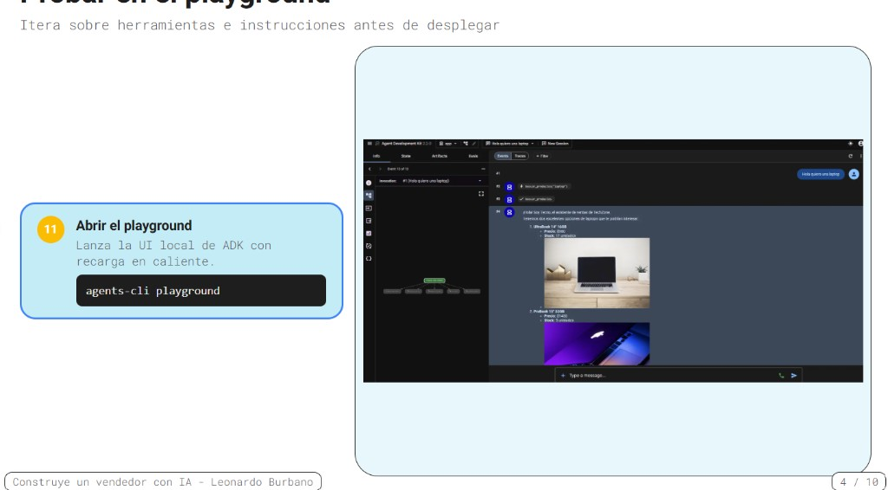

> **Versión en inglés:** [TUTORIAL.md](TUTORIAL.md)

# Construye un vendedor con IA — Tutorial local

<p align="center">
  <strong>Primer paso del workshop: crea un agente ADK con herramientas y pruébalo en el playground local.</strong>
</p>

<p align="center">
  <a href="https://adk.dev/"></a>
  <a href="https://google.github.io/adk-docs/tools/agents-cli/"></a>
  <a href="https://aistudio.google.com/"></a>
  <a href="README.es.md"></a>
</p>

**Tutorial introductorio** del repositorio [Gemini Enterprise Agent Platform Workshop](README.es.md). Parte desde cero con `agents-cli`, implementa **Tecno** — el asistente de ventas de TechZone — y termina con el agente funcionando en el **playground local**.

<table>
<tr><td><b>Objetivo</b></td><td>Agente multi-herramienta con sub-agente de descuentos, validado en <code>agents-cli playground</code></td></tr>
<tr><td><b>Duración estimada</b></td><td>45–90 minutos (setup + implementación + pruebas)</td></tr>
<tr><td><b>Código de referencia</b></td><td><a href="agent.txt"><code>agent.txt</code></a> → copiar en <code>app/agent.py</code></td></tr>
<tr><td><b>Siguiente paso</b></td><td>Eval → deploy → FastAPI → Next.js → Gemini Enterprise (<a href="README.es.md">README.es.md</a>)</td></tr>
</table>

---

## Flujo del tutorial



| Parte | Qué harás | Comando clave |
| ----- | --------- | ------------- |
| **1** | Instalar herramientas y CLI | `uvx google-agents-cli setup` |
| **2** | Obtener API key y crear proyecto | `agents-cli create …` |
| **3** | Implementar catálogo, tools y agentes | editar `app/agent.py` |
| **4** | Probar flujo de venta completo | `agents-cli playground` |

---

## Parte 1 — Requisitos previos

Instala y configura estas herramientas **antes** de comenzar.



| # | Herramienta | Para qué sirve | Instalar |
| - | ----------- | -------------- | -------- |
| 1 | **Python** | Agente ADK y backend FastAPI | [python.org](https://www.python.org/downloads/) |
| 2 | **Node.js** | Frontend Next.js (pasos posteriores) | [nodejs.org](https://nodejs.org/) |
| 3 | **uv** | Gestor de paquetes Python | [astral.sh/uv](https://docs.astral.sh/uv/getting-started/installation/) |
| 4 | **IDE** | Cursor, VS Code u otro editor | — |
| 5 | **Google AI Studio** | Modelos Gemini y API keys | [aistudio.google.com](https://aistudio.google.com/) |
| 6 | **Agents CLI** | Desarrollo local de agentes | ver abajo |

Instala el CLI y las skills oficiales:

```bash
uvx google-agents-cli setup
```

---

## Parte 2 — API key y proyecto del agente



### Paso 9 — Obtener una API key de Gemini

1. Abre [Google AI Studio → API keys](https://aistudio.google.com/apikey).
2. Inicia sesión con tu cuenta de Google.
3. Crea una API key y guárdala en un lugar seguro.

### Paso 10 — Crear tu primer agente

Genera un proyecto ADK de prototipo:

```bash
uv run agents-cli create buildaiagent --agent adk --prototype --api-key TU_API_KEY
cd buildaiagent
agents-cli install
```

> **¿Ya clonaste este repositorio?** Usa el agente incluido:
>
> ```bash
> cd sales-agent-cloud
> agents-cli install
> ```
>
> Archivo destino: `sales-agent-cloud/app/agent.py`.

---

## Parte 3 — Implementar el agente TechZone

Abre `app/agent.py`. Construye el agente en seis bloques — detalle completo en [`agent.txt`](agent.txt).

### Bloque 1 — Imports

```python
from google.adk.agents import Agent
from google.adk.apps import App
from google.adk.models import Gemini
from google.adk.tools import ToolContext
from google.genai import types
```

Para desarrollo local con API key de AI Studio no necesitas Vertex AI. Al desplegar en Google Cloud, añade el bloque de credenciales al final de [`agent.txt`](agent.txt).

### Bloque 2 — Catálogo

Define `CATALOGO` con productos reales (id, nombre, categoría, precio, stock, imagen). El agente **nunca inventa precios**: todo sale de las herramientas.

### Bloque 3 — Herramientas

| Herramienta | Qué hace |
| ----------- | -------- |
| `buscar_productos` | Busca en el catálogo por nombre o categoría |
| `agregar_al_carrito` | Añade items al carrito de sesión (`tool_context.state`) |
| `ver_carrito` | Muestra items y total |
| `confirmar_pedido` | Descuenta stock, crea el pedido y vacía el carrito |

### Bloque 4 — Sub-agente de descuentos

`agente_descuentos` se activa cuando el cliente objeta el precio (máximo 10% en un producto). ADK enruta con `sub_agents`, no con prompts sueltos.

### Bloque 5 — Agente raíz "Tecno"

`root_agent` con instrucciones de venta, las cuatro herramientas y `sub_agents=[agente_descuentos]`.

### Bloque 6 — Punto de entrada

```python
app = App(root_agent=root_agent, name="app")
```

Copia el archivo completo desde [`agent.txt`](agent.txt) o sigue los comentarios `# STEP N`.

---

## Parte 4 — Probar en el playground



### Paso 11 — Abrir el playground

```bash
agents-cli playground
```

La UI local de ADK se abre con **recarga en caliente**: cada guardado en `app/agent.py` actualiza el agente.

### Prompts de prueba

| # | Escribe en el chat | Resultado esperado |
| - | ------------------ | ------------------ |
| 1 | `Hola, quiero una laptop` | `buscar_productos` + imágenes Markdown |
| 2 | `Agrega la laptop-01 al carrito` | `agregar_al_carrito` |
| 3 | `¿Qué tengo en el carrito?` | `ver_carrito` |
| 4 | `Está muy caro, ¿hay descuento?` | transferencia a `agente_descuentos` |
| 5 | `Confirmo, soy Ana` | `confirmar_pedido` |

En la pestaña **Tools** verás llamadas y respuestas en tiempo real.

---

## Siguiente paso

Con el agente validado en playground, continúa con [README.es.md](README.es.md):

| Fase | Comando / carpeta |
| ---- | ----------------- |
| Evaluar | `agents-cli eval generate` → `agents-cli eval grade` |
| Desplegar | `agents-cli deploy` |
| Backend | `fastapi-agent-client/` |
| Frontend | `nextjs-agent-client/` |
| Publicar | `agents-cli publish gemini-enterprise` |

---

## Sobre el autor

<table>
<tr>
<td width="140" valign="top">

</td>
<td valign="top">

**Leonardo Burbano**  
Senior AI Engineer & Tech Lead · @Mercately [Techstars]

<p>
<a href="https://github.com/leonardoburbanov"></a>
<a href="https://github.com/leonardoburbanov/gemini-enterprise-agent-platform-workshop"></a>
<a href="https://www.linkedin.com/in/leoburbano/"></a>
<a href="https://www.instagram.com/leo.burbano.ai/"></a>
</p>

Lidero el equipo de IA en Mercately, donde diseño e implemento agentes conversacionales, pipelines RAG y flujos multi-agente sobre Google Cloud y Gemini. Entre código, arquitectura y mentoría, me enfoco en llevar sistemas de IA de prototipo a producción — y en compartir ese camino en workshops y contenido técnico.

</td>
</tr>
</table>

<p align="center">
  <sub>Construido para el <strong>Gemini Enterprise Agent Platform Workshop</strong></sub>
</p>
