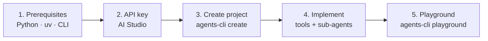

> **Also available in Spanish:** [TUTORIAL.es.md](TUTORIAL.es.md)

# Build an AI Sales Agent — Local Tutorial

<p align="center">
  <strong>Workshop step one: build an ADK agent with tools and test it in the local playground.</strong>
</p>

<p align="center">
  <a href="https://adk.dev/"></a>
  <a href="https://google.github.io/adk-docs/tools/agents-cli/"></a>
  <a href="https://aistudio.google.com/"></a>
  <a href="README.md"></a>
</p>

**Introductory tutorial** for the [Gemini Enterprise Agent Platform Workshop](README.md) repo. Start from scratch with `agents-cli`, implement **Tecno** — the TechZone sales assistant — and finish with the agent running in the **local playground**.

<table>
<tr><td><b>Goal</b></td><td>Multi-tool agent with discount sub-agent, validated in <code>agents-cli playground</code></td></tr>
<tr><td><b>Estimated time</b></td><td>45–90 minutes (setup + implementation + testing)</td></tr>
<tr><td><b>Reference code</b></td><td><a href="agent.txt"><code>agent.txt</code></a> → copy into <code>app/agent.py</code></td></tr>
<tr><td><b>Next step</b></td><td>Eval → deploy → FastAPI → Next.js → Gemini Enterprise (<a href="README.md">README.md</a>)</td></tr>
</table>

---

## Tutorial flow



| Part | What you do | Key command |
| ---- | ----------- | ----------- |
| **1** | Install tools and CLI | `uvx google-agents-cli setup` |
| **2** | Get API key and create project | `agents-cli create …` |
| **3** | Implement catalog, tools, and agents | edit `app/agent.py` |
| **4** | Test the full sales flow | `agents-cli playground` |

---

## Part 1 — Prerequisites

Install and configure these tools **before** starting.


| # | Tool | Purpose | Install |
| - | ---- | ------- | ------- |
| 1 | **Python** | ADK agent and FastAPI backend | [python.org](https://www.python.org/downloads/) |
| 2 | **Node.js** | Next.js frontend (later steps) | [nodejs.org](https://nodejs.org/) |
| 3 | **uv** | Python package manager | [astral.sh/uv](https://docs.astral.sh/uv/getting-started/installation/) |
| 4 | **IDE** | Cursor, VS Code, or another editor | — |
| 5 | **Google AI Studio** | Gemini models and API keys | [aistudio.google.com](https://aistudio.google.com/) |
| 6 | **Agents CLI** | Local agent development | see below |

Install the CLI and official skills:

```bash
uvx google-agents-cli setup
```

---

## Part 2 — API key and agent project


### Step 9 — Get a Gemini API key

1. Open [Google AI Studio → API keys](https://aistudio.google.com/apikey).
2. Sign in with your Google account.
3. Create an API key and store it securely.

### Step 10 — Create your first agent

Scaffold a prototype ADK project:

```bash
uv run agents-cli create buildaiagent --agent adk --prototype --api-key YOUR_API_KEY
cd buildaiagent
agents-cli install
```

> **Already cloned this repo?** Use the included agent:
>
> ```bash
> cd sales-agent-cloud
> agents-cli install
> ```
>
> Target file: `sales-agent-cloud/app/agent.py`.

---

## Part 3 — Implement the TechZone agent

Open `app/agent.py`. Build the agent in six blocks — full detail in [`agent.txt`](agent.txt).

### Block 1 — Imports

```python
from google.adk.agents import Agent
from google.adk.apps import App
from google.adk.models import Gemini
from google.adk.tools import ToolContext
from google.genai import types
```

For local development with an AI Studio API key you do not need Vertex AI. When deploying to Google Cloud, add the credentials block at the end of [`agent.txt`](agent.txt).

### Block 2 — Catalog

Define `CATALOGO` with real products (id, name, category, price, stock, image). The agent **never invents prices** — everything comes from tools.

### Block 3 — Tools

| Tool | Purpose |
| ---- | ------- |
| `buscar_productos` | Search the catalog by name or category |
| `agregar_al_carrito` | Add items to the session cart (`tool_context.state`) |
| `ver_carrito` | Show items and total |
| `confirmar_pedido` | Deduct stock, create the order, and clear the cart |

### Block 4 — Discount sub-agent

`agente_descuentos` activates when the customer objects to price (max 10% on one item). ADK routes via `sub_agents`, not prompt hacks.

### Block 5 — Root agent "Tecno"

`root_agent` with sales instructions, the four tools, and `sub_agents=[agente_descuentos]`.

### Block 6 — Entry point

```python
app = App(root_agent=root_agent, name="app")
```

Copy the full file from [`agent.txt`](agent.txt) or follow the `# STEP N` comments.

---

## Part 4 — Test in the playground


### Step 11 — Open the playground

```bash
agents-cli playground
```

The local ADK UI opens with **hot reload**: every save to `app/agent.py` updates the agent.

### Test prompts

| # | Type in chat | Expected result |
| - | ------------ | --------------- |
| 1 | `Hola, quiero una laptop` | `buscar_productos` + Markdown images |
| 2 | `Agrega la laptop-01 al carrito` | `agregar_al_carrito` |
| 3 | `¿Qué tengo en el carrito?` | `ver_carrito` |
| 4 | `Está muy caro, ¿hay descuento?` | handoff to `agente_descuentos` |
| 5 | `Confirmo, soy Ana` | `confirmar_pedido` |

On the **Tools** tab you will see tool calls and responses in real time.

---

## Next step

Once the agent works in the playground, continue with [README.md](README.md):

| Phase | Command / folder |
| ----- | ---------------- |
| Evaluate | `agents-cli eval generate` → `agents-cli eval grade` |
| Deploy | `agents-cli deploy` |
| Backend | `fastapi-agent-client/` |
| Frontend | `nextjs-agent-client/` |
| Publish | `agents-cli publish gemini-enterprise` |

---

## About the author

<table>
<tr>
<td width="140" valign="top">

</td>
<td valign="top">

**Leonardo Burbano**  
Senior AI Engineer & Tech Lead · @Mercately [Techstars]

<p>
<a href="https://github.com/leonardoburbanov"></a>
<a href="https://github.com/leonardoburbanov/gemini-enterprise-agent-platform-workshop"></a>
<a href="https://www.linkedin.com/in/leoburbano/"></a>
<a href="https://www.instagram.com/leo.burbano.ai/"></a>
</p>

I lead the AI team at Mercately, designing and shipping conversational agents, RAG pipelines, and multi-agent workflows on Google Cloud and Gemini. Between code, architecture, and mentoring, I focus on taking AI systems from prototype to production — and sharing that path through workshops and technical content.

</td>
</tr>
</table>

<p align="center">
  <sub>Built for the <strong>Gemini Enterprise Agent Platform Workshop</strong></sub>
</p>
